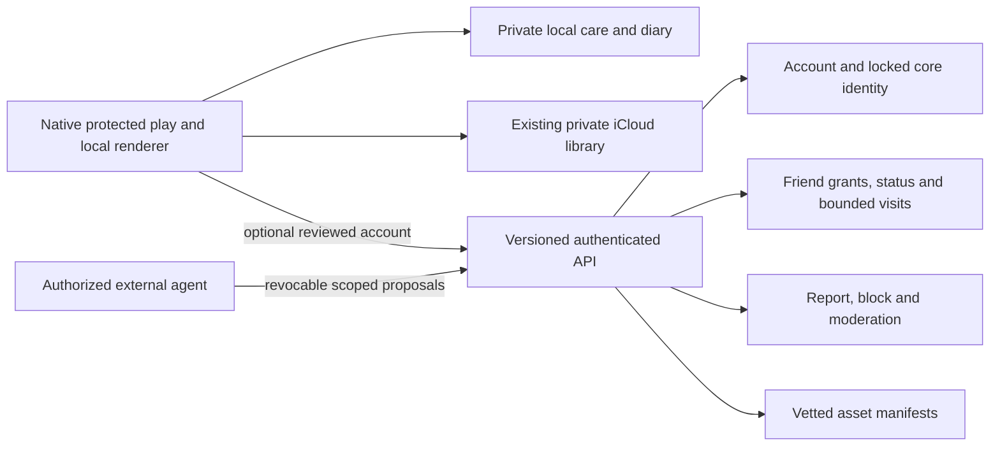

# Social Fonsters: product and backend review plan

8 October 2026 · proposal only · no account, infrastructure or transmission enabled

## What exists and what comes next

The native app already has a fuzzy procedural 3D lobby, care, dance, local action
interpretation, camera/speech imitation and reversible movement practice. Its
library uses SwiftData and the existing private iCloud setup. Visits are exported
files, friendships are local, and the experimental agent/profile code has no real
social account service. Protected play now gates exports/device inputs and blocks
external quote/flag requests and agent handoffs. This audit is not a declaration
of child privacy or store approval: operator contacts, website policy, country
review, private iCloud use and hardware behavior still need release validation.

Nathan's direction is to retain that base for children and people who decline
permissions, then let eligible older users opt into accounts and a social world.
An avatar visit must be presented as a creature's asynchronous interaction—not
the human owner's live response, consent, current location or inferred feelings.
No account screen, real discovery, diary upload or third-party integration is
activated by this plan.

## Phases and acceptance gates

| Phase | Product result | Evidence needed before enabling it |
| --- | --- | --- |
| 0 · preserve protected play | Landscape phone lobby, portrait care/sheets, local play without signup, clear native privacy notice, parent export/input tasks. | Native build/rotation/input-cancel/legacy/data-preservation checks; operator contact and matching published policy; reviewed audience/countries. Current implementation is this phase. |
| 1 · private accounts and identity | Optional eligible-user signup, private account library, generated choices, explicit core-appearance lock, editable surface styling; export/deactivate/delete in app. | Feature-specific regional eligibility and age assurance; auth/relay-email/account-linking tests; server authorization; deletion/revocation/backup-restore tests; owner review of seed design and lock UX. No location/calendar/health permission needed. |
| 2 · invited friends | Private home lobby with accepted friends' creatures, bounded nonverbal asynchronous visits, mutually accepted friendships and approved text-free keepsake exchange. | Invite expiry, both-party consent, discreet block/unblock/report/moderation/contact tools; no teen/adult stranger matching; clear avatar/owner provenance; revocation and deletion propagate to cached lobbies. |
| 3 · private diary and chosen status | Private feelings history and entries; exploratory circular icon picker; optional local suggestions of vetted emotion/action IDs; user chooses any social status and audience. | Journal isolation, local processing/fallback, no automatic publication, accessibility/undo; status TTL and audience tests; sensitive/private content never appears in social payloads. |
| 4 · optional discovery and context | Separately reviewed nearby discovery, calendar/Watch-derived activity suggestions and delegated agent control. | Separate opt-ins and purpose-specific grants; regional/classification review; home/school/routine exposure assessment; abuse/rate-limit tests; revocation, background and stale-input handling. Start with adults and trusted friends; minors excluded from stranger discovery in the proposed initial design. |
| 5 · places and portability | Vetted restaurants, parks, exercise/shopping/travel spaces and collectibles; later web/Android/Windows clients using versioned contracts. | Licensed original asset manifests; sensitive-place policy (schools especially); no attendance/travel inference from collectibles; sync conflict/offline/replay tests; reviewed platform release operations. |

Each phase is independently releasable only after its gate. Declining signup or
any optional capability keeps protected play usable. None of the later phases is
authorized to launch by the current planning task.

## Nonverbal social contract

Nathan's latest direction narrows all future social content to a finite, approved
vocabulary. Social scenes, payloads, visits and memorabilia must not contain
personal names, bios, diary entries or profile preference text. No arbitrary
text, user audio, images, custom textures/files, URLs or executable instructions
may pass through an emotion, action, asset or agent field. Necessary settings,
consent, reporting and accessibility UI remain distinct; accessibility must
describe vetted actions without reading excluded personal content.

| Allowed social expression | Proposed bounded representation |
| --- | --- |
| Emotion | Approved `emotionID`, facial/behavior preset and clamped movement energy; no inferred private diary label or free-text emotion. |
| Activity bubble | Approved `activityIconID` above the creature; no text caption. |
| Creature sound | Vetted `soundPresetID`/`voicePresetID` and bounded playback parameters; clients play their approved local sound catalog. No original or user-generated audio bytes. |
| Selected activities | Approved IDs for ball play, walking, sitting, climbing, swimming and running, with bounded durations/routes and both-party controls. No arbitrary commands/scripts. |
| Memorabilia | Approved text-free catalog item ID/version, bounded placement and recipient grant; no inscription, custom image or identifying embedded payload. |
| Music listening | Music icon only until requested. The sole social text exception is existing track title and album/provider metadata; approved provider track/album IDs resolve licensed artwork and authorized playback links. No audio stream is shared. |

Recording audio and transforming it into a Fonster sound is an unresolved design
idea. Recordings stay private/local input for now; a remote creature receives only
an approved preset ID and bounded parameters. No remote generation, audio upload,
voice cloning or generated-audio delivery pipeline is authorized by this plan.
AI suggestions must map to this finite schema and preserve user selection, Stop,
revocation and audience control. Unknown IDs or out-of-range values are rejected.

For music, the viewer deliberately chooses playback through their own selected
service. The first candidate is a single permitted provider with minimal authorized
metadata and user-initiated playback, not cross-service matching. Match region/catalog availability, handle unavailable tracks gracefully,
and apply explicit-content/family controls to metadata and artwork as well as
playback. Never request streaming-provider OAuth or create accounts in this task.
Playback links are provider-authorized, allowlisted resolutions of validated IDs;
they are not a general user-supplied URL field.

**Provider terms gate:** this music metadata/playback design is conditional, not
an approved integration. Spotify's current policy restricts games, child-targeted
products, cross-service content integration and standalone metadata/art uses.
Apple's MusicKit agreement ties album art/music text to playback or playlist
management and imposes additional use limits. API availability does not grant
permission for a cross-service avatar status. Establish a permitted scope or
explicit provider authorization before configuration, OAuth or implementation.
Until then, a generic approved music activity icon can exist independently; no
track metadata, artwork or provider integration is enabled.
[Spotify Developer Policy](https://developer.spotify.com/policy),
[Apple Developer Program License Agreement, MusicKit](https://developer.apple.com/support/terms/apple-developer-program-license-agreement/).

| Constrained music option | Gate and limitation |
| --- | --- |
| Generic listening icon | Approved local activity ID; no provider account, metadata, art, history or implied actual playback. Available as a catalog concept independently of integration. |
| Apple player-first candidate | Dedicated native catalog search/playback sheet using `ApplicationMusicPlayer`, standard user-initiated controls, unchanged authorized artwork/title, `MusicAuthorization` and `MusicSubscription.canPlayCatalogContent` checks. Owner approval of the precise licensed scope and MusicKit App Service for the explicit App ID/bundle; add `NSAppleMusicUsageDescription` only with an approved implementation. Do not invent an entitlement key or configure service/credentials now. Playback/playlist-linked metadata only, not a standalone social artwork feed. Current device Music app queue state and recently played history are not a cross-device live listening feed. |
| Spotify candidate | Provider clarification/permission for the actual game/child-product context and cross-service constraints, plus reviewed access/quota eligibility before credentials or user authorization. Hiding features does not cure a prohibited product classification. No integration assumed. |
| User-selected expiring track reference | Later reviewed metadata source/license and explicit audience/TTL; viewer-initiated authorized provider link. No audio, tokens or listening history broadcast, autoplay, guaranteed matching or assumed public YouTube Music now-playing API. |

Future cross-service matching is separately gated. ISRC alone does not establish
the same recording/version/storefront: verify version, duration and regional
availability and show an honest no-match result. Unknown explicit-content status
is not clean; do not alter licensed artwork in ways a provider prohibits.

Apple's review guidance permits MusicKit in apps/games subject to its requirements;
keep Fonster disco animation independent of track timing, and add no music-linked
rewards, paywall, ads or autoplay. The generic music icon can open the reviewed
player sheet. Peer sharing of an expiring catalog ID/storefront/link/time remains
a separate default-off feature requiring clarification for this exact social use.
No audio, token, library/history or artwork upload is proposed. This narrower MVP
is recommended, not configured or licensed merely by being documented.
[Apple review guideline 4.5.2](https://developer.apple.com/app-store/review/guidelines/#apple-music),
[native automatic token generation setup](https://developer.apple.com/documentation/musickit/using-automatic-token-generation-for-apple-music-api).

Plan a **Connect Music** settings section with three separate controls: Fonsters
identity, a provider connection, and default-off listening-status sharing. Apple
uses provider-native MusicKit authorization; other eligible providers would use
their reviewed OAuth flow. Never collect provider passwords. Show authorization,
denial, unavailable subscription, disconnect and revocation states honestly;
disconnect removes queued/expiring status and related grants without harming local
play or deleting the Fonsters library. Do not promise functional Spotify or
YouTube Music connection until policy/access feasibility is cleared. This product
request does not authorize developer credentials or Nathan's provider account.
No provider music audio enters any future TTS/sound-effect generation pipeline.

## Built-in neighborhood characters

Plan a clearly marked built-in/NPC cast so a new or offline user has engaging
companions before connecting with real people. A consistent nonverbal built-in
badge and necessary onboarding/accessibility explanation identify these as
simulated characters in the virtual neighborhood. They never claim nearby GPS
presence, human online status, sentience or an actual response from Nathan.
No location permission is needed to place them in the virtual world.

Characters may draw loosely from Nathan's public creative interests in building/
coding, music, photography, travel and crafts. Do not use private messages, exact
locations, family/children, health or finances as public character material.
Authoring names/notes stay internal; social surfaces use only the approved
nonverbal vocabulary. Musical interests use generic icons/presets until a licensed
provider feature is approved; never invent actual playback or use unlicensed art.
The parent worker is preparing a private initial cast proposal; it is not shipped
or publicly uploaded by this plan.

The parent's private proposal includes six draft characters, interaction loops,
text-free keepsakes and procedural sound prototypes. Its private Library
identifiers remain in ignored local evidence, not public source. Proposed IDs and
audio are not adopted in the app; numeric audio checks are distinct from listening
tests. No files were materialized or integrated by this native implementation task.

Give the cast persistent coherent mood/routine/state and actual bounded mechanics:
greet newcomers, walk/dance/rest, play ball, remember creature encounters, and
offer text-free catalog collectibles after real eligible interactions with
cooldowns. Respect pause/Stop, recipient controls, low power/background and Reduce
Motion. No guilt, absence penalties, fabricated popularity or false gift delivery.
Only offer/confirm collectibles that the current simulation actually grants.

Separate versioned shared character definitions (approved descriptor/style,
routine/state rules, action/emotion/sound IDs and collectible eligibility) from
owner-private encounter history. Use deterministic offline-safe simulation with
bounded elapsed-time catch-up; content changes must not erase a user's memories.
NPC upkeep belongs to a validated content pipeline: schema/asset/license review,
finite vocabulary validation, deterministic scenario checks, versioning and
rollback. It must work while this assistant and any external agent are offline.

The existing four account-consistent starter appearances are private editable
library records, not this curated NPC system. Add a separate built-in catalog and
encounter namespace alongside them; do not replace their seeds, migrate their
private history or delete existing user Fonsters. Review this overlap before any
starter-character implementation.

Discreet blocking is the proposed default: no notification or explicit "blocked"
message to the other person, while the server prevents discovery/location/status,
visits, gifts, music access and recontact. Invalidate caches/subscriptions and queued
interactions immediately. Unblocking restores only capabilities the user explicitly
chooses; it does not replay old gifts/visits or automatically restore friendship.
Someone may infer a block; the app must not promise otherwise. Mute or an optional
hidden presentation needs separate truthful semantics. Never falsely confirm that
a gift or interaction was delivered.

The restricted vocabulary still needs cooldowns, per-pair/global caps, report/block,
vetted assets and safeguards against repeated pursuit, spam, abusive combinations,
identifying rhythm/patterns, targeting and explicit music metadata. See the
[social threat model](../privacy/social-threat-model.md).

**Conflict with current local exports:** current `.fonstervisit` files contain a
creature name and can optionally contain backstory/preferences/feeling; current
private library profiles accept text. Legacy seed links are also recoverable text.
These remain parent-directed local exports, not compliant future social payloads.
Never upload/reuse those envelopes for live social visits. Add a separate versioned
allowlisted projection that excludes their personal text. Keep the frozen 2D format
and existing private records readable; no silent migration or deletion is planned.

## Identity and appearance

Nathan proposed email plus GPS/device metadata for reroll seeds. **Recommended
alternative, awaiting Nathan's approval:** use a random server-owned account ID
and a random reroll nonce/counter to generate candidates; store the chosen
resolved creature parameters and generator/descriptor version. This gives abundant
variation without requesting extra permissions or placing personal data in an
appearance seed. Email belongs to authentication/contact data, not identity art.
GPS/device characteristics must not be harvested to increase candidate entropy.

Choose and preview candidates before an explicit lock step. Display exactly what
will be fixed: silhouette, facial layout, palette/markings and original resolved
core descriptor. After lock, the server rejects core changes. Fuzz/fur/hair/scales/
shiny surface styles remain editable as a separate versioned style layer and must
preserve recognizability. Account deletion/deactivation ends this identity under
the selected lifecycle policy; do not reuse its public ID for another person.

Keep account ID, public creature ID, auth-provider subjects, private care keys,
diary keys and legacy seed text separate. Random public IDs must not reveal email,
CloudKit account digests, device IDs or coordinates. Do not silently convert a
child's existing editable Fonster into a locked account identity. Offer an explicit
eligible-user import/selection preview with new identity and clear copying rules.
Legacy 2D links remain readable; they contain recoverable seed text and are not a
safe account identifier or social authorization token.

## Proposed architecture and data ownership

Private iCloud is not the authoritative social backend. The proposed API owns
account eligibility, locked identity, social grants and deletion. The native app
owns rendering, offline play, raw camera/audio, local interpretation and default
diary content. Keep HealthKit-derived information out of iCloud and social data;
any future private journal sync needs a separately reviewed storage/key design.
An iCloud login does not mean someone has consented to a public account.

| Domain | Proposed records and controls |
| --- | --- |
| Identity/auth | Random `accountID`; provider/subject links and private contact/relay email; minimal eligibility attributes with assurance provenance, reviewed region, policy version/expiry and revocation. Exact birthday/ID documents should not be retained merely to make avatars. |
| Creature | Random `publicCreatureID`; immutable `coreDescriptor`/hash/generator version/lock timestamp; mutable `surfaceStyle`; private owner mapping. Appearance never encodes account contact/location. |
| Library/care | Owner-private saved creatures and separate local tendency/movement memory. Explicit sync ownership and conflict versions; no schema migration without review. |
| Social | Two-sided friend grants, private lobby membership, approved emotion/activity/sound IDs with bounded values and audience/expiry, bounded visit events with actor source (`ownerSelected`, `localAutonomy`, `authorizedAgent`) and timestamp. No personal names, bios, preference text, email, journal, calendar event, user audio or precise coordinates. |
| Diary | Owner-private entries and locally chosen/suggested icon IDs; encrypted local storage/key handling and export/deletion requirements. No default backend upload or public status linkage. |
| Keepsakes/assets | Vetted text-free catalog asset kind/version/hash/license, bounded recipients and idempotent exchange events. Generic non-identifying catalog keepsakes can survive deletion only after origin linkage and identifying metadata are removed; custom text/art are never accepted social content. |
| Safety/lifecycle | Block/report records, moderation queue, narrowly retained abuse evidence, account deletion jobs, revocations/tombstones and documented backup expiry. Retention bases and periods must be reviewed and published. |

Proposed REST responsibilities: `/v1/session`, `/v1/account/eligibility`,
`/v1/creature/candidates`, `/v1/creature/lock`, `/v1/creature/style`,
`/v1/friend-invites`, `/v1/lobbies`, `/v1/status`, `/v1/visits`,
`/v1/keepsake-exchanges`, `/v1/blocks` (block/unblock), `/v1/music-status`,
`/v1/reports`, `/v1/account/export`
and `/v1/account/deletion`. All mutations require server authorization, schema
validation, idempotency, rate limits and audit of authorization outcomes without
raw private content. Clients cannot set their own eligibility or locked identity.
Agents get revocable grants, not owner OAuth refresh tokens or journal access.

Use one authoritative writer/scheduler for visits, deletion and exchanges. Backend
provider, operator, region, access roles and budget are open choices. Any future
hosted API deployment must follow this repo's current AWS migration policy and
verified ownership; this plan creates no infrastructure, credentials or deployment.

## Permissions and private-to-social boundaries

| Capability | Default and intended behavior |
| --- | --- |
| Camera/microphone | Off; independent opt-in; existing local imitation/commands remain available without social signup. No media upload from the local feature. A future media-sharing feature needs its own reviewed scope. |
| Location | Off; manual city/venue choice should work. Nearby discovery is a separately reviewed purpose, not candidate generation. Prefer coarse/delayed regions; never expose exact routes or home/school locations. No initial minor stranger discovery. Precise/background location is a distinct later decision, with visible activity and automatic expiry. |
| Calendar | Off; derive only a minimal proposed activity on device. EventKit full access is broader than a read-only grant, so explain it accurately; manual activity works without it. Do not transmit titles, attendees, locations or schedules. |
| Watch/health | Off; local suggestions only after purpose-specific authorization. No health/routine signals in public status or diary upload by default. Health data storage/sharing needs separate review. |
| External agents | Off; review actor and scopes (movement, reactions, chosen status, friend visits, learning), audience, duration and revocation. Always-on proposals must obey server grants/TTL/rate limits; owner Stop/takeover and revoked consent win. The old “Everything” local scope does not authorize new sensitive access. |
| Diary contribution | Off; never describe summaries as anonymous without reidentification assessment. Separate explicit opt-in must name destination, exact fields, purpose, retention, withdrawal and any training use. No donation/training/remote inference implementation now. |

The diary icon grid should show broad families and then finer choices in a circle,
with large targets, hover/accessibility names and a clear selected state. Optional
on-device processing returns only vetted IDs for suggestions. The user selects the
emotion, then separately chooses whether/how long/to whom to share a public status.
Raw entries and inferred sensitive labels never become a public status implicitly.
Only approved nonverbal emotion/action IDs enter the social projection.
Fallback to the same icon picker when a local model is unavailable. It is not a
diagnostic or psychological assessment.

## Regional eligibility and store requirements

Eligibility must be feature-specific, not `age >= 13` worldwide. Treat missing,
declined, expired or untrusted age/region signals as protected play. Determine the
actual intended audience/service classification before choosing a neutral screen,
parental-consent flow or account age. COPPA can apply to child-directed processing
without accounts; identifiers, analytics, SDKs and inferred information need audit.
[FTC compliance plan](https://www.ftc.gov/business-guidance/resources/childrens-online-privacy-protection-rule-six-step-compliance-plan-your-business),
[FTC age-screen FAQ](https://www.ftc.gov/business-guidance/resources/complying-coppa-frequently-asked-questions).

| Region/platform | Review requirement; no clearance implied |
| --- | --- |
| US | COPPA under-13 and actual child-directed/mixed-audience classification, relevant state age/consent/privacy rules and each social feature. US 13+ is only a review boundary in current code. |
| Netherlands/EU | GDPR Article 8 defaults to 16 for relevant consent-based child processing; member-state rules differ. Parent research identifies Netherlands 16; verify the national basis before rollout (the Dutch regulator page returned 403 to this worker). [GDPR Article 8](https://eur-lex.europa.eu/legal-content/EN/TXT/?uri=CELEX:32016R0679), [Dutch regulator consent guidance](https://autoriteitpersoonsgegevens.nl/themas/basis-avg/avg-algemeen/grondslag-toestemming). |
| UK | Consent age and under-18 design protections are distinct. Assess DPIA, high-privacy defaults, profiling and geolocation for likely child access. [ICO code](https://ico.org.uk/for-organisations/uk-gdpr-guidance-and-resources/childrens-information/childrens-code-guidance-and-resources/age-appropriate-design-a-code-of-practice-for-online-services/code-standards/). |
| Australia | Covered social platforms must prevent under-16 accounts; actual service classification matters. Calling it a game or disabling one feature does not establish exclusion. [eSafety assessment](https://www.esafety.gov.au/about-us/industry-regulation/social-media-age-restrictions/assessment). |
| Apple | Since September 2026, submissions/updates declare social-media capabilities regardless of category. Social functionality normally yields at least 13+; the lower-rating path with under-13 social disabled requires Declared Age Range at minimum. This is not legal permission at 13. [Apple notice](https://developer.apple.com/news/?id=0d2gpmml), [age assurance](https://developer.apple.com/support/age-assurance). |

The current code has no Declared Age Range integration and no enabled real social
feed; it cannot support a future lower-rated mixed social release without further
work. Older OS/unsupported platform/declined range must remain protected rather
than bypass eligibility. Remote flags cannot turn a protected visitor into an
eligible account. Review region/assurance policies with expiry and changes, and
enforce equivalent restrictions on the server and future clients.

Google/Facebook/other provider login remains a proposal. Review Apple's equivalent
privacy-preserving login requirement; Sign in with Apple is the straightforward
candidate. Explicit permission is required before personal data goes to an external
AI provider. Public user content requires filtering/moderation, reporting, blocking
and reachable support before launch. These requirements belong to the product,
not optional post-launch tasks. [Apple guidelines](https://developer.apple.com/app-store/review/guidelines/).

## Account export, deactivation and deletion

Deletion starts in app and revokes provider links/tokens, including Sign in with
Apple tokens if used. Remove identity/avatar/profile, auth links, diary, status,
location/context, social membership and other owner data from active systems;
cancel agents and queued jobs, invalidate invitations and notify caches. Publish
backup retention and restore-time deletion replay; no unreviewed fixed period is
promised here. Narrow legally required abuse/fraud records need a stated basis.
[Apple deletion guidance](https://developer.apple.com/help/app-review/guideline-reference/5-1-1-account-deletion).

Keep deactivation distinct from deletion: immediately stop visibility/agents and
grants; Nathan must choose whether restoration is offered and which private data
is temporarily retained. Do not release/reassign the old public identity. Provide
an export with private data scoped to its owner. Friends may retain only genuinely
non-identifying generic memorabilia under the reviewed policy. Screenshots or
copies already controlled by recipients cannot be remotely erased; make that
limit clear before sharing, rather than promising universal deletion.

## Conflicts and choices for Nathan

- Approve or replace the proposed random identity/reroll nonce design. Email/GPS/
  device-based seeds are his original proposal, not an approved implementation.
- Choose first account countries, intended age cohorts, private friends versus
  adult nearby discovery, providers and operator contact/retention policies.
- Define exactly which core traits lock versus editable surface styling, whether
  existing Fonsters can be selected, and what deactivation/restoration means.
- Decide whether status is always user-confirmed or any narrowly scoped automation
  can publish selected IDs; diary content remains separate in either case.
- Name backend ownership/region/budget and moderation/support operators before
  provisioning. Choose diary sync/key-recovery requirements independently.
- Current textual profiles/local visit exports conflict with the new nonverbal
  social contract. Keep them private/parent-directed and implement a distinct
  social projection; never silently turn backstory or a name into social content.
- Current profiles/appearance seeds are editable and local visit IDs can rotate
  after appearance edits. A future account lock must add server authority without
  breaking those existing child records, portraits or legacy links.
- Current local agent handoff is deliberately disabled in protected play. A future
  reviewed account grant must not reuse a global local “all scopes” setting as
  authorization for other people, calendars, health or location.
